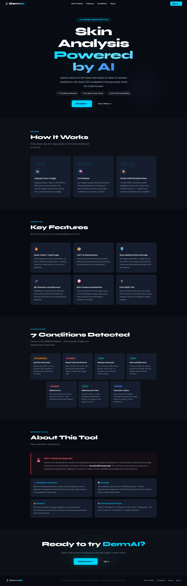
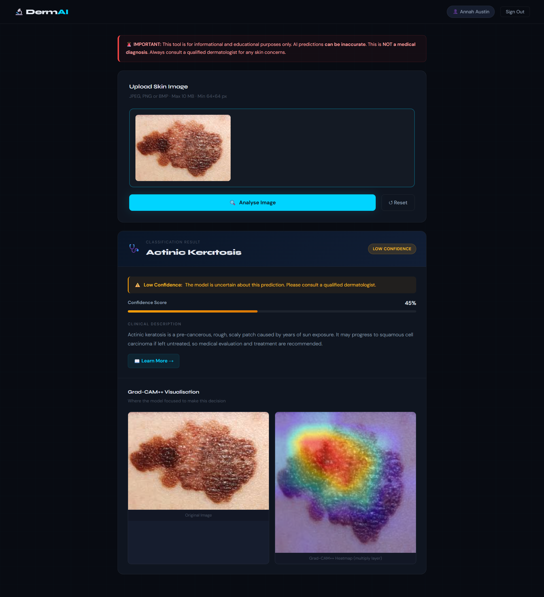

# DermAI Classifier

AI-powered skin disease classification using MobileNetV2 + Squeeze-and-Excitation attention.  
Provides disease name, confidence score, clinical description, Learn More URL, and Grad-CAM++ heatmap.

> **Disclaimer:** This tool is for educational and informational purposes only. It is NOT a medical diagnosis. Always consult a qualified dermatologist for any skin concerns.
## Website

### Landing Page


### Prediction & Grad-CAM Analysis


---

## Architecture

```
MVC Pattern (overarching):
  Model      → api/domain/, api/repositories/, api/services/
  View       → frontend/  (HTML/CSS/JS)
  Controller → api/routers/ (FastAPI)

OOP Design Patterns:
  Singleton  → ModelManager              (load model once)
  Repository → UserRepository            (abstract DB access)
  Factory    → PredictionResponseFactory
  Strategy   → MobileNetV2PreprocessingStrategy
  Observer   → PredictionEventPublisher + LoggingListener
```
## Model Performance

Trained on the **HAM10000** dermoscopic dataset (7 skin disease classes).  
Compared MobileNetV2 baseline against 3 attention-enhanced variants using two-phase transfer learning.

| Model | Test Accuracy | Macro F1 |
|---|---|---|
| MobileNetV2 Baseline | 72.05% | — |
| SE Attention | 70.51% | — |
| ECA Attention | 72.56% | — |
| Coordinate Attention | 73.33% | — |
| **SE Attention (Optuna Tuned)** | **73.59% ✅ Best** | **0.7657** |

Hyperparameter tuning performed with **Optuna**. Final model selected based on test accuracy, macro F1-score, and Grad-CAM++ visual interpretability analysis.
---

## Quick Start

### 1. Prerequisites

- Python 3.11+
- PostgreSQL 15+ running locally
- Your `.keras` model file

### 2. Install dependencies

```bash
pip install -r requirements.txt
```

### 3. Set up the database

```bash
# Create PostgreSQL user and database
bash setup_db.sh

# OR manually:
createdb dermai_db
createuser dermai_user
psql -c "ALTER USER dermai_user WITH PASSWORD 'dermai_pass';"
psql -c "GRANT ALL ON DATABASE dermai_db TO dermai_user;"
```

### 4. Configure environment

```bash
cp .env.example .env

```

### 5. Model file

The trained model is already included in the repository:

ml/skin_model.keras

It will be automatically loaded at application startup by the `ModelManager`.


### 6. Run the application

```bash
uvicorn api.main:app --reload --host 0.0.0.0 --port 8000
```

Open http://localhost:8000 in your browser.

> **Note:** Always access the app via `http://localhost:8000`. Do **not** use VS Code Live Server (port 5500) — it cannot serve the static files or API routes correctly.

---

## Project Structure

```
dermai/
├── api/
│   ├── main.py                    # FastAPI app factory + lifespan
│   ├── config.py                  # Settings from .env
│   ├── database.py                # SQLAlchemy engine + session
│   ├── routers/
│   │   ├── auth.py                # Register, login, refresh, logout (Controller)
│   │   └── predict.py             # Image upload + prediction (Controller)
│   ├── schemas/
│   │   ├── auth.py                # Pydantic DTOs for auth
│   │   └── prediction.py          # Pydantic DTOs for prediction
│   ├── services/
│   │   ├── image_validation.py    # Magic bytes, size, dimension checks
│   │   ├── skin_detector.py       # YCbCr skin presence gate (pre-inference)
│   │   ├── gradcam.py             # Grad-CAM++ targeting 'multiply' layer
│   │   └── jwt_service.py         # JWT create/verify/revoke
│   ├── repositories/
│   │   ├── models.py              # SQLAlchemy User model (ONLY table)
│   │   └── user_repository.py     # Repository Pattern — DB operations
│   ├── domain/
│   │   ├── model_manager.py       # Singleton — loads .keras model
│   │   ├── prediction_factory.py  # Factory — builds PredictionResponse
│   │   └── disease_config.py      # Loads ml/class_config.yaml
│   ├── strategies/
│   │   └── preprocessing.py       # Strategy — MobileNetV2 preprocess_input
│   └── events/
│       └── prediction_events.py   # Observer — prediction event pub/sub
├── frontend/
│   ├── index.html                 # Landing page (hero, features, conditions, about)
│   ├── login.html                 # Sign in page
│   ├── register.html              # Create account page
│   └── analysis.html              # Main analysis + Grad-CAM display
│   └── static/
│       └── js/api.js              # Centralised API client + TokenStore
├── ml/
│   ├── class_config.yaml          # Disease class metadata
│   └── skin_model.keras           # ← Place your model here
├── tests/
│   ├── conftest.py                # Shared fixtures (SQLite in-memory test DB)
│   ├── unit/
│   │   ├── test_image_validation.py
│   │   ├── test_preprocessing_and_jwt.py
│   │   ├── test_prediction_factory.py
│   │   └── test_skin_detector.py
│   └── integration/
│       ├── test_auth.py
│       └── test_predict.py
├── .env.example
├── requirements.txt
├── pytest.ini
└── docker-compose.yml
└── setup_db.sh
└── dockerignore
└── Dockerfile
```

---

## Skin Presence Detection

Before any inference, uploaded images are validated for skin content using a **YCbCr colour space gate**:

1. **Tight YCbCr range check** — pixels must fall within known human skin chrominance bounds
2. **Morphological coherence** — closing + opening operations remove noise and isolated pixels
3. **Largest connected component** — must comprise ≥ 20% of the image area

Images that fail this check (animals, objects, blank images, etc.) are rejected with HTTP 422 before the model is ever called. The detector is **fail-open** — if an internal error occurs, the image is allowed through rather than blocking legitimate uploads.

> **Known limitation:** Images with large areas of orange/amber tones (e.g. certain cats) may pass the gate due to colour space overlap with human skin tones.

---

## Running Tests

Tests use **SQLite in-memory** (no PostgreSQL needed) and mock the ML model and skin detector.

```bash
# Run all tests
pytest

# With coverage report
pytest --cov=api --cov-report=term-missing

# Run only unit tests
pytest tests/unit/ 

# Run only integration tests
pytest tests/integration/

# Run a specific test file
pytest tests/unit/test_skin_detector.py -v
```

**Current results:** 97/97 tests passing · 83% overall coverage

| Module | Coverage |
|--------|----------|
| `jwt_service.py` | 100% |
| `preprocessing.py` | 100% |
| `schemas/` | 100% |
| `config.py` | 100% |
| `skin_detector.py` | 96% |
| `auth.py` | 94% |
| `gradcam.py` | 20% (requires real GPU/model — validated manually) |

---

## API Endpoints

| Method | Path | Auth | Description |
|--------|------|------|-------------|
| POST | /api/v1/auth/register | No | Register new user |
| POST | /api/v1/auth/login | No | Login → JWT tokens |
| POST | /api/v1/auth/refresh | Refresh token | Refresh access token |
| POST | /api/v1/auth/logout | Yes | Revoke refresh token |
| GET  | /api/v1/auth/me | Yes | Get current user |
| POST | /api/v1/predict | Yes | Upload image → prediction |
| GET  | /api/v1/health | No | Service health check |
| GET  | /api/v1/diseases | No | List all disease classes |

Interactive API docs: http://localhost:8000/docs

---

## Supported Disease Classes

Trained on the **HAM10000** dataset. Classes are mapped alphabetically (index 0–6):

| Index | Code | Condition | Type |
|-------|------|-----------|------|
| 0 | akiec | Actinic Keratosis | Pre-cancerous |
| 1 | bcc | Basal Cell Carcinoma | Malignant |
| 2 | bkl | Benign Keratosis | Benign |
| 3 | df | Dermatofibroma | Benign |
| 4 | mel | Melanoma | Malignant |
| 5 | nv | Melanocytic Nevi | Benign |
| 6 | vasc | Vascular Lesion | Vascular |

---

## Grad-CAM Target Layer

The model architecture uses a Squeeze-and-Excitation (SE) block outside MobileNetV2:

```
MobileNetV2 (7,7,1280)
    ↓              ↓  (skip)
   GAP → Reshape → Dense(80) → Dense(1280)
                                    ↓
             multiply([MobileNetV2_out, SE_weights])   ← TARGET LAYER
                    ↓
             GAP_1 → Dropout → Dense(7 classes)
```

The `multiply` layer (output: `None, 7, 7, 1280`) captures both spatial features and SE channel recalibration — giving more accurate heatmaps than targeting a layer inside the backbone.

---

## Privacy & Security

- **Only the `users` table exists in PostgreSQL** — `user_id`, `email`, `display_name`, `hashed_password`, timestamps.
- No images, predictions, confidence scores, or disease labels are ever written to disk or database.
- Passwords are hashed with **bcrypt** (cost factor 12).
- Authentication uses **JWT** — short-lived access tokens + revocable refresh tokens.
- All image processing is **ephemeral and in-memory only**.

---

## Environment Variables

| Variable | Default | Description |
|----------|---------|-------------|
| `DATABASE_URL` | — | PostgreSQL connection string |
| `JWT_SECRET_KEY` | — | HS256 signing secret (min 32 chars) |
| `MODEL_PATH` | `ml/skin_model.keras` | Path to your .keras model |
| `LOW_CONFIDENCE_THRESHOLD` | `0.50` | Below this → show low confidence warning |
| `VERY_LOW_CONFIDENCE_THRESHOLD` | `0.30` | Below this → show strong warning |
| `MAX_UPLOAD_MB` | `10` | Max image upload size |
| `GRADCAM_TARGET_LAYER` | `multiply` | Keras layer name for Grad-CAM |
| `SE_REDUCTION_RATIO` | `16` | Squeeze-and-Excitation reduction ratio |


## Running with Docker
```bash
docker compose up --build
```

Once the containers start, open http://localhost:8000

The trained model at `ml/skin_model.keras` is mounted automatically.

To stop:
```bash
docker compose down
```
